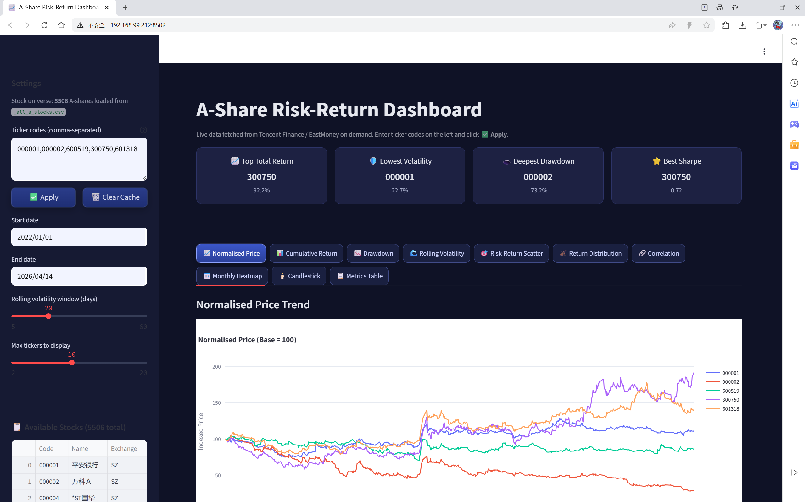
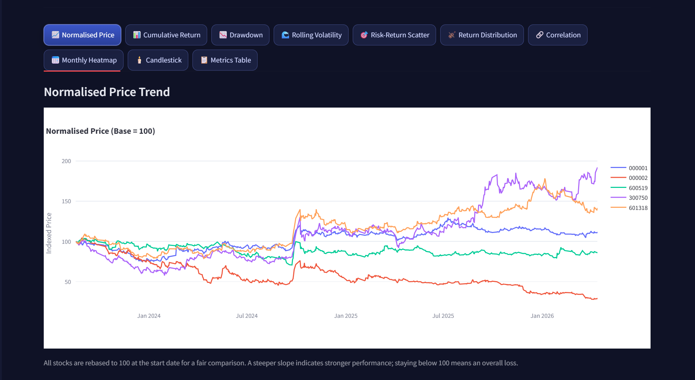
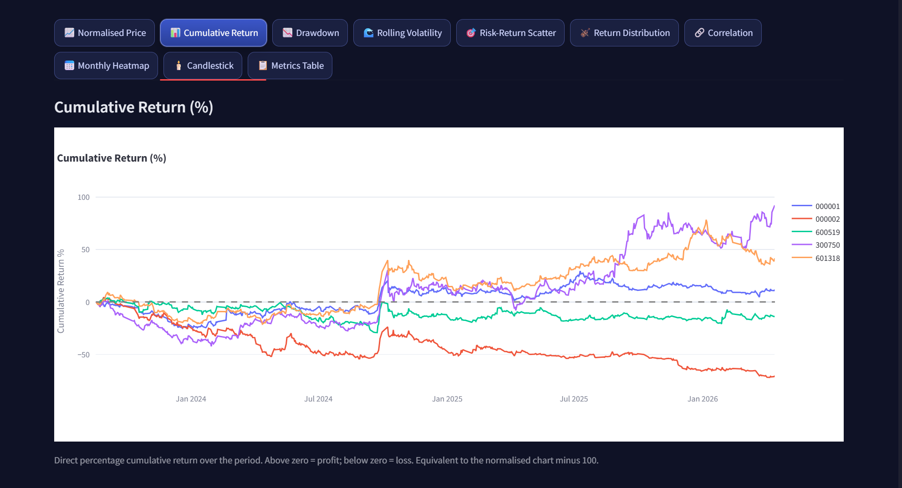
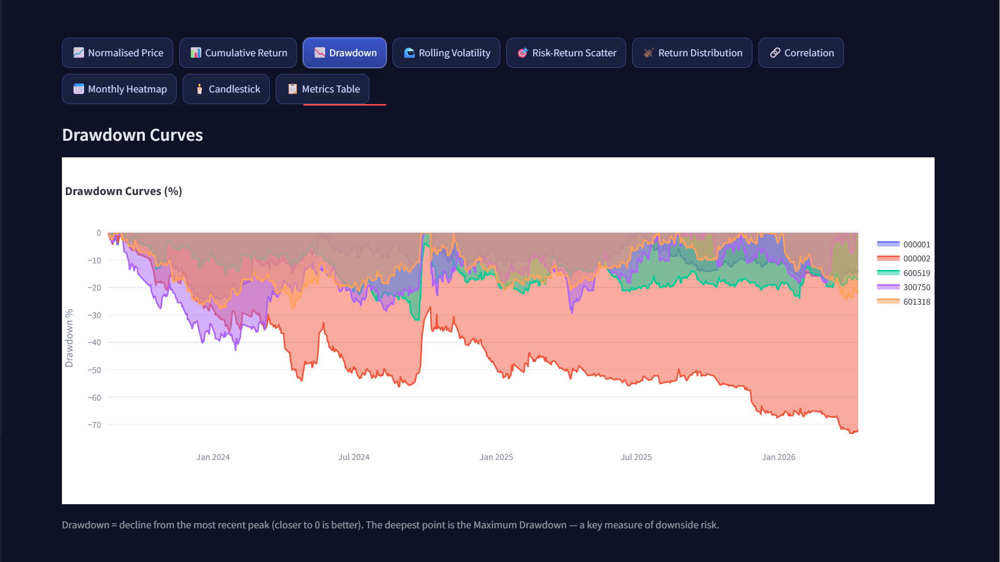
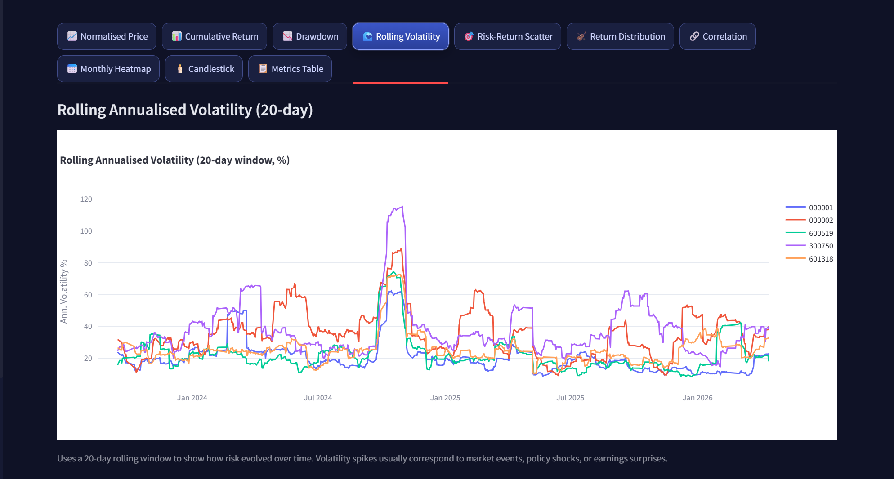
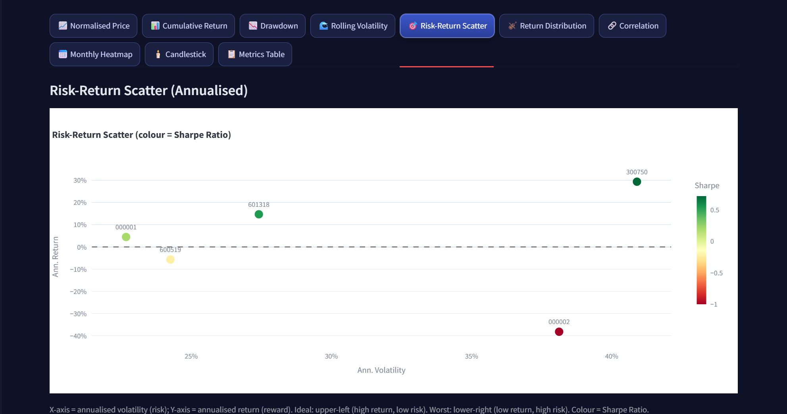
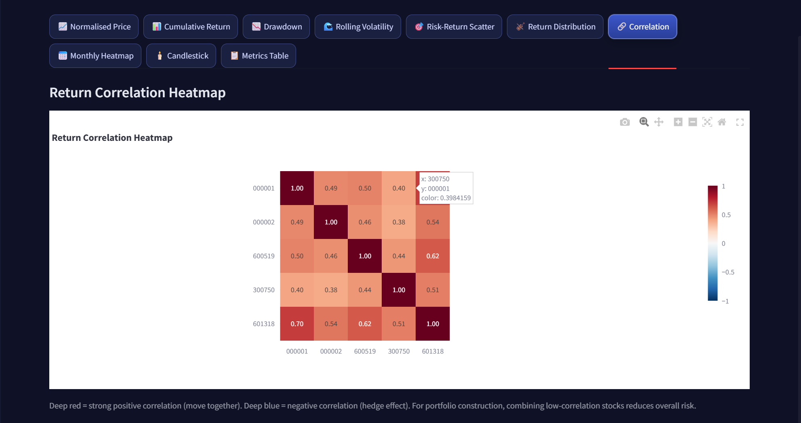
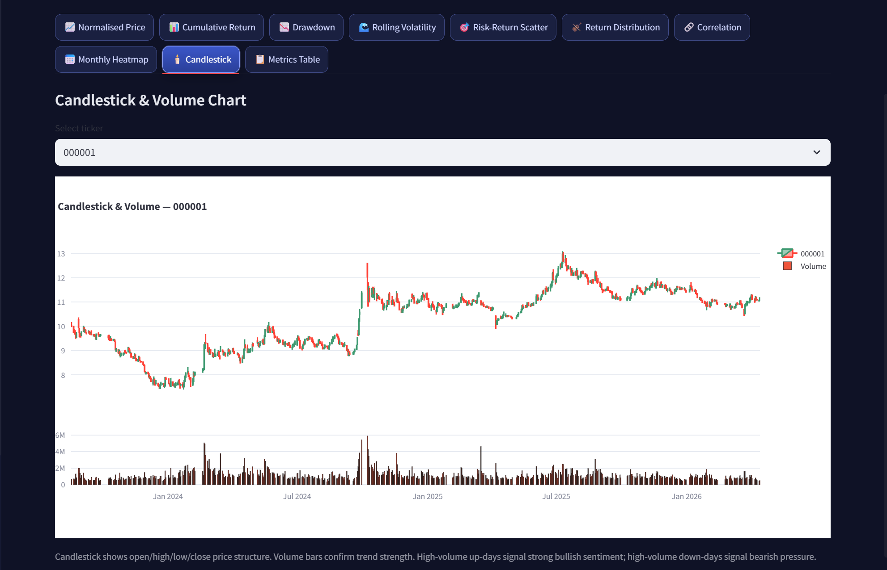
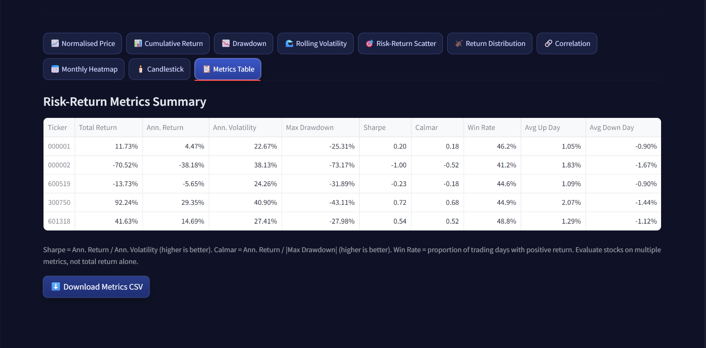

# Reflection Report - ACC102 Track 4

## Product Title
A-Share Risk-Return Dashboard (Streamlit)

## 1) Analytical Problem and Target User
The analytical problem in this project is how to help non-technical users quickly evaluate and compare the risk-return profile of multiple A-share stocks without needing advanced financial knowledge or coding skills. In real investment practice, users often focus only on price increases and ignore risk indicators such as volatility and drawdown. This can lead to poor decision-making, especially in unstable market conditions.

The target users are beginner-to-intermediate investors and finance students. These users need a practical tool that converts raw market data into understandable visual evidence and concise metrics. Therefore, the product was designed as an interactive dashboard where users can enter stock codes, select a date range, and immediately view risk-return analytics.

## 2) Dataset and Why It Was Selected
The project uses A-share daily OHLCV data fetched online from Tencent Finance (primary source) and EastMoney Finance (fallback source). The stock universe is defined by `data/_all_a_stocks.csv`, which provides `symbol`, `name`, and `exchange` information.

This dataset/source combination was selected for three reasons:
1. **Business relevance**: A-share data is strongly connected to real financial decision scenarios.
2. **Coverage**: It supports broad multi-stock comparison instead of single-case analysis.
3. **Product usability**: Users can fetch data on demand by code, which keeps the tool interactive and practical.

Data access date should be stated in submission metadata as April 2026.

## 3) Python Methods and Technical Workflow
The notebook and app implement a full Python workflow from data input to user-facing output:

- **Data acquisition**: API requests are made via `requests.Session` (proxy-disabled) with source fallback logic.
- **Data cleaning**: date parsing, numeric conversion, invalid-row removal (`close <= 0`, `high < low`), deduplication, chronological sorting.
- **Transformation**: close-price matrix construction, forward fill, daily return computation.
- **Metric calculation**: Total Return, Annualised Return, Annualised Volatility, Maximum Drawdown, Sharpe Ratio, Calmar Ratio, Win Rate, and Average Up/Down Day.
- **Visual analytics**: Normalised Price, Cumulative Return, Drawdown, Rolling Volatility, Risk-Return Scatter, Violin Distribution, Correlation Heatmap, Monthly Heatmap, and Candlestick + Volume.
- **Communication**: KPI cards, tabbed chart layout, and downloadable metrics CSV.

This satisfies the requirement of substantial Python execution rather than a presentation-only front end.

## 4) Main Insights and Product Value
The final product communicates value in three ways:

1. **Relative performance clarity**: users can see which stocks outperform in cumulative return and whether that outperformance is stable.
2. **Risk transparency**: drawdown and volatility views reveal downside pressure that pure return charts can hide.
3. **Portfolio thinking support**: correlation heatmap and risk-return scatter help users reason about diversification and risk-adjusted efficiency.

In practical use, a stock with high return but deep drawdown may not be suitable for risk-averse users, while a lower-return but lower-volatility stock can have better risk-adjusted attractiveness.

## 5) Limitations, Reliability, and Improvements
This product has several limitations:

- API availability may fluctuate, causing partial fetch failures during unstable network periods.
- Daily data frequency does not capture intraday risk.
- Sharpe ratio currently assumes risk-free rate = 0 for simplicity.
- Transaction costs, taxes, and slippage are not modelled.
- Survivorship bias may exist if delisted stocks are not included in the selected analysis set.

Planned improvements:
- Add optional offline cache mode for stronger reliability in demo/assessment environments.
- Add user-configurable risk-free rate.
- Add more robust retry/backoff and fetch diagnostics for unstable API responses.

## 6) Personal Contribution and Learning
I independently designed and implemented the end-to-end workflow: data fetching integration, cleaning logic, metric modelling, chart construction, and interface optimisation. I also iterated the UI based on usability feedback (button visibility, tab accessibility, and layout readability).

Through this task, I learned that data products must balance **analytical rigor** and **user communication**. A technically correct model is not enough if the output is hard to interpret. Conversely, a polished UI without transparent methods cannot achieve academic credibility. This project improved my ability to connect Python analytics with product-oriented thinking.

## 7) AI Use Disclosure
AI tools were used to support coding efficiency, refactoring, UI wording, and documentation drafting. Final logic design, data source decisions, validation, and submission curation were completed by the student.

- Tool: Cursor AI Assistant (Codex-based)
- Access period: April 2026
- Usage scope: code debugging, refactoring suggestions, UI text refinement, report drafting assistance

---

## Figures

**Figure 1. Main Dashboard Overview**  

**Figure 2. Normalised Price and Cumulative Return**  
  

**Figure 3. Drawdown and Rolling Volatility**  
  

**Figure 4. Risk-Return Scatter and Correlation Heatmap**  
  

**Figure 5. Candlestick + Metrics Table + CSV Download**  
  

> Note: Figure 11 and Figure 12 are merged into one screenshot as requested.
